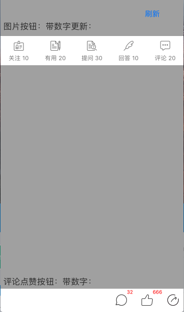

# KokyDefineButton
-
简要说明：

- ALMyPageBarButton
自定义button:设置样式，图片文字位置

- ALMyPageButtonView
放置多个按钮的view，所有数据设置，点击方法，刷新方法等

初始化调用及点击方法：

```
 _buttonsView = [[ALMyPageButtonView alloc]initWithFrame:CGRectMake(0, 100, self.view.frame.size.width, 60) ImgArr:@[@"my_page_followProfession_icon",@"my_page_userfulArticle_icon",@"my_page_question_icon",@"my_page_answer_icon",@"my_page_comment_icon"] titleLableArr:@[@"关注 10",@"有用 20",@"提问 30",@"回答 10",@"评论 20"]];
    [self.view addSubview:_buttonsView];
    
    [_buttonsView myPageButtonViewTapedCompletionHandler:^(NSInteger buttonIndex,NSString *buttonTitle) {
        // 点击了按钮，操作写这里
        NSLog(@"点击的按钮是第：%ld个,标题是：%@",buttonIndex + 1,buttonTitle);
    }];
```

截图

